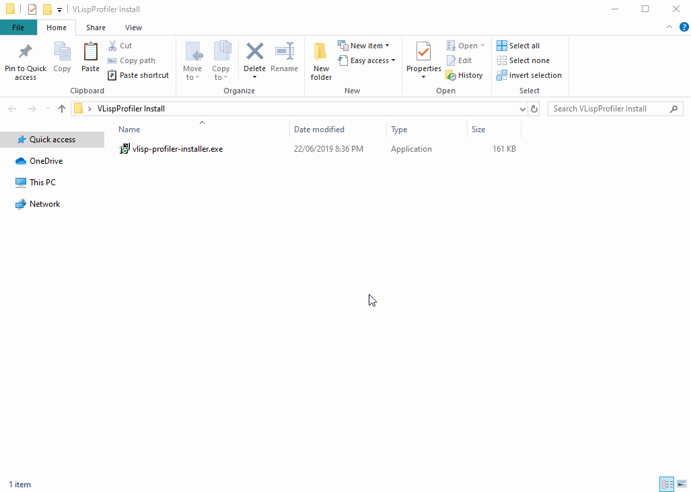
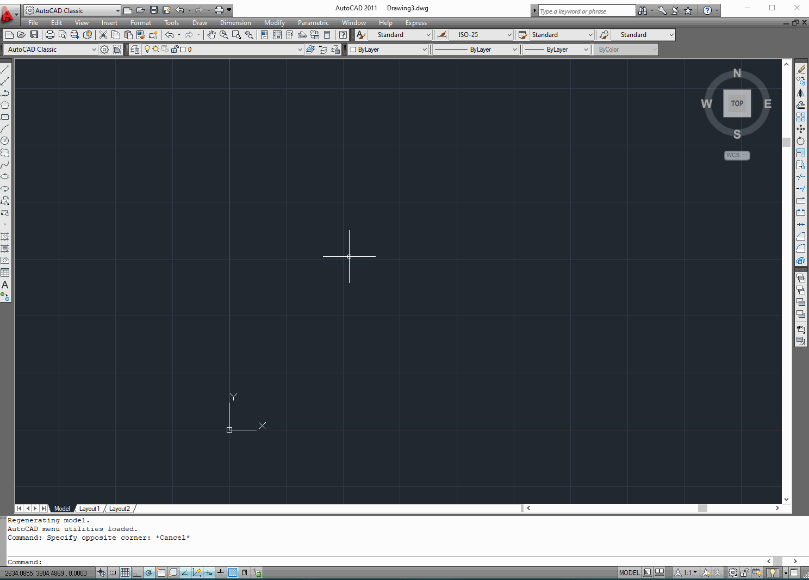

# VLispProfiler

VLispProfiler is a tool for AutoCAD to measure the
performance of applications built with Visual LISP.

Use this tool to see where your application is spending
it's time and guide where you should optimize.

## Get Started

### Installing
Download and run the latest installer. See [Releases](https://github.com/talanc/vlisp-profiler/releases)).

### Profiling
1. Open AutoCAD
2. Type `prof`
3. Select a LISP file to profile.
4. Type in an entry function, leave empty and press `Enter` if the file doesn't have one.
5. Observe profiling results.

#### Profiling the whole file

#### Profiling from entry function

